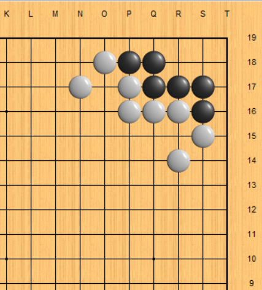
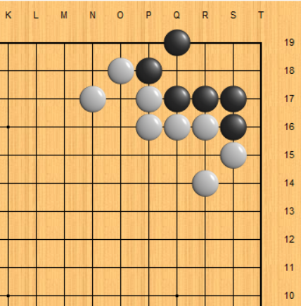
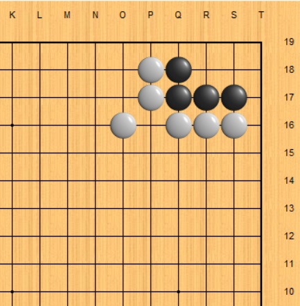
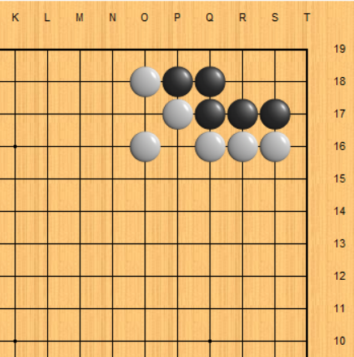
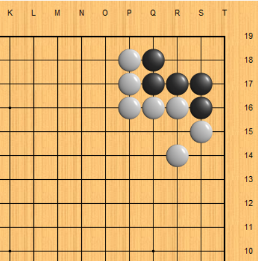
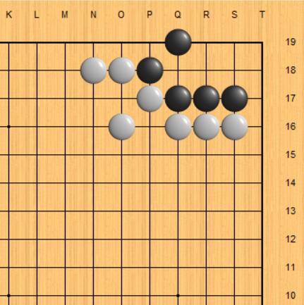
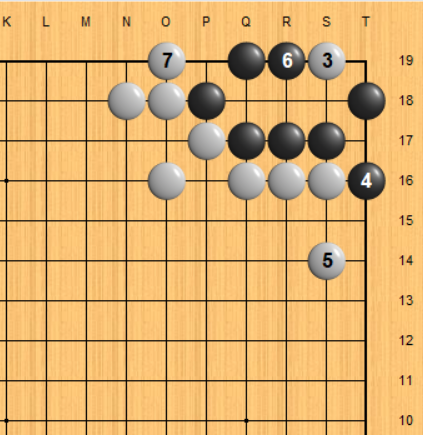
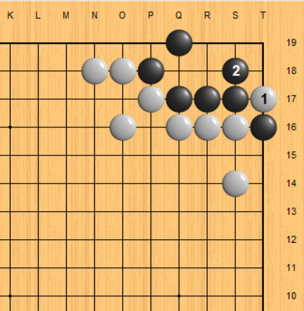
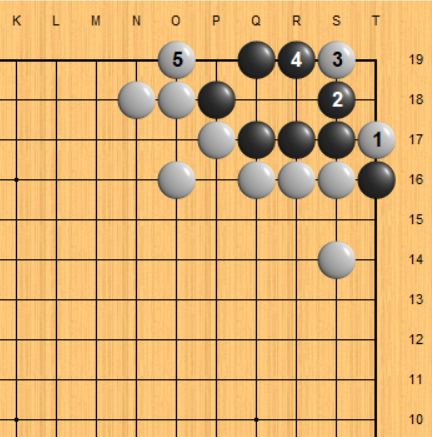

# 林海峰【死活與手筋之急所】

本頁旨在用口訣形式總結【死活與手筋之急所】裡面嘅基本死活形態及結果，以方便記憶。由於版權考慮，內容只會顯示每個形嘅開始狀況，而唔會顯示所有變化／結果。

## 第二章－角之基本死活

### 基本型之一

角上六目形加上兩邊伸腿且二路緊貼，黑活。白S18點則黑T18扳；白外面扳則黑S18退。

> 變化：其中一腿改為倒虎（即大豬嘴加伸腿），黑活。白O19立下係攻擊要點，黑S19可活。

### 基本型之二
角上六目形加上二路緊貼，黑死。白主要以刀五點中殺。計算簡單，不作贅述。

> 變化一：長嘅一邊多伸一腿，黑先活。第一手須為S18曲。白先則扳後還原基本型。

> 變化二：短嘅一邊多伸一腿，黑先活。第一手須為S19以防禦R19點入。白先則T16縮小眼位便可。

**通用原則**：留意白先如果S18點加上黑棋外圍有援軍的話，黑有一路扳有可能係先手。所以白先扳收窄空間先係上策。

### 基本型之三
經典大豬嘴，變化多端。簡單說法係白先黑死。白先記住次序：扳、點、立、撲，黑Q18將成為假眼。

黑棋反抗，第四步不於S18接而T16提，白S14跳冷靜。（假如外圍有黑棋增援如何？）

> 變化一：黑多扳一手，黑活，但次序要小心。白T17先撲，黑S18曲僅此一手，如果提則白點後還原上形。以後白有S19點或O19立，均不成立，唯點入後的處理要謹慎。

